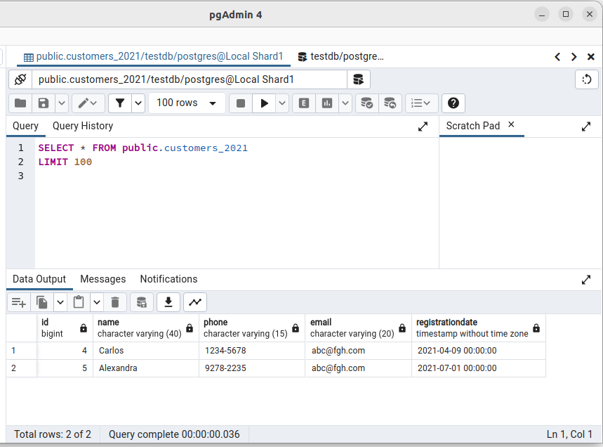

# Postgresql Sharding
PostgreSQL Sharding Example, demonstrates how (horizontally scale PostgreSQL) dividing a table (customers) into 3 servers (shard1, shard2 and shard3) 
This is using 100% PostgreSQL technology, and I use docker and docker-compose just to simulate the 4 servers


:dancers: 

## Running Postgresql Sharding
The only concern to run this demo is to make sure posrgresql is not running already on your host machine, as the master runs on port 5432 it may collide with an existing running instance.

| Servers     | Port  | Table          |
| ------------| ------|----------------|
| pg_master   | 5432  | customers      |
| pg_shard_1  | 15432 | customers_2021 |
| pg_shard_2  | 25432 | customers_2022 |
| pg_shard_3  | 35432 | customers_2023 |

:woman_dancing:
to start the cluster run:
```
docker-compose up
```
to stop the cluster (and keep the data)
```
docker-compose down
```
to stop the cluster (removing the database, it will be recreated again next time you docker-compose up)
```
docker-compose down -v
```

## Checking if it works
1 - Connect you pgAdmin to all the 4 instances:


2 - run some inserts into the master database:


3 - run sql statemet to check the master:
### pg_master:


4 - run sql on the nodes to check if the data is distributed:
### pg_shard_1:


### pg_shard_2:


### pg_shard_3:

